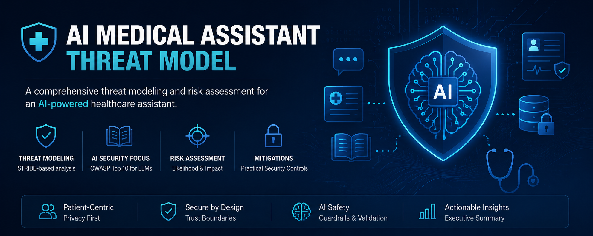
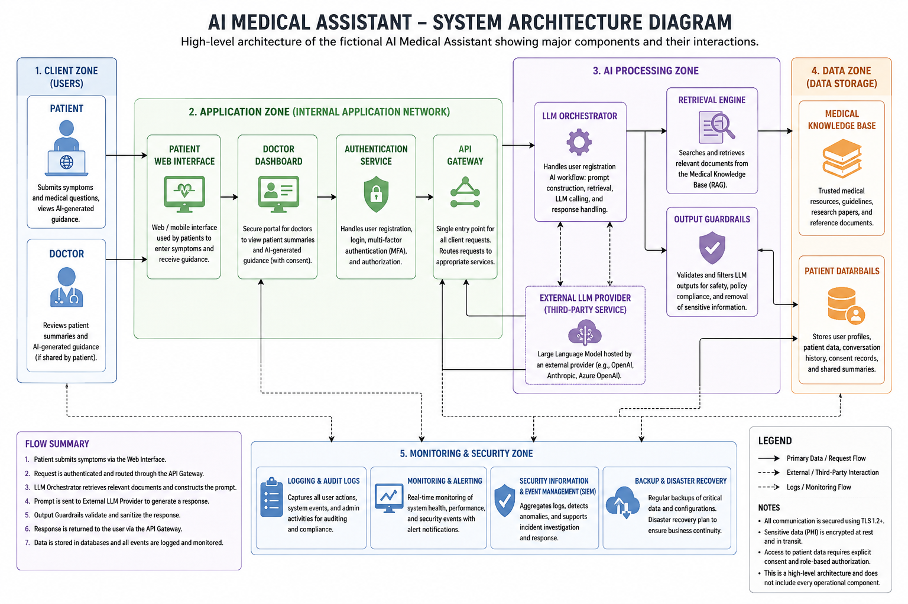
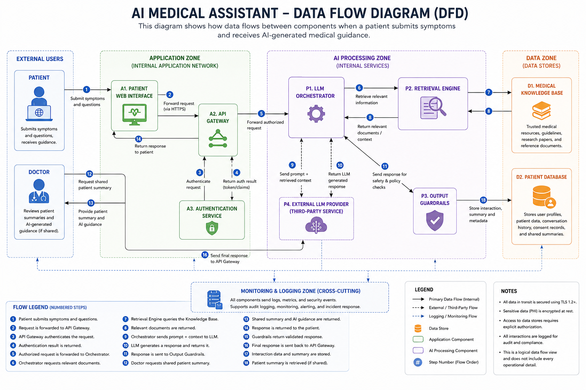
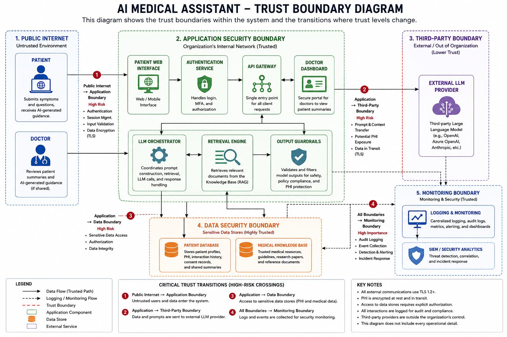
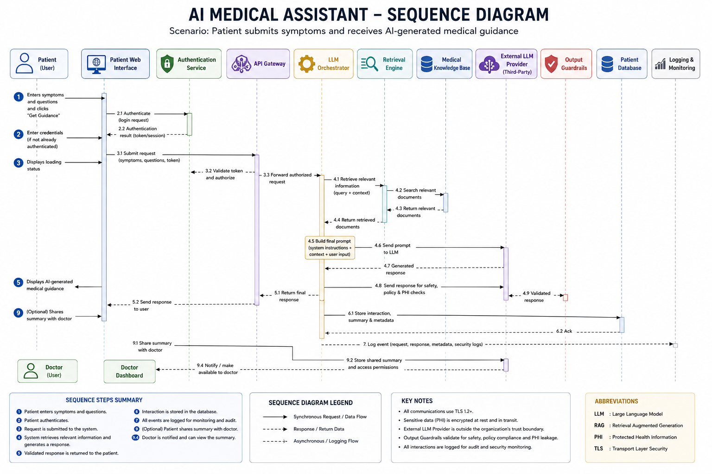

# AI Medical Assistant Threat Modeling Case Study

## Introduction

Artificial Intelligence is rapidly transforming healthcare. Applications powered by Large Language Models (LLMs) can analyze patient symptoms, retrieve trusted medical references and generate preliminary medical guidance within seconds.

These capabilities offer significant benefits, but they also introduce serious security and safety risks.

If an AI healthcare application is not properly secured, attackers may be able to steal sensitive patient records, manipulate model behavior, poison trusted medical knowledge sources or generate harmful medical advice.

Because healthcare systems process highly sensitive Personal Health Information (PHI), security failures can affect both patient privacy and patient safety.

This project demonstrates how a security team can assess an AI-powered healthcare application before it is developed and deployed.

In this scenario, a healthcare organization is planning to launch an AI Medical Assistant that will allow patients to:

1. Submit symptoms and medical questions
2. Retrieve trusted medical references using Retrieval-Augmented Generation (RAG)
3. Receive AI-generated medical guidance
4. Share summaries with authorized doctors

Before development begins, the security team is tasked with evaluating the proposed architecture, identifying the most significant risks and recommending the controls required to deploy the system safely.

The objective of this assessment is to answer a critical question:

> Can this AI Medical Assistant be deployed safely, and what security controls must be implemented before launch?

## Methodology

This project follows a structured methodology commonly used in professional threat modeling engagements.

The assessment begins by modeling the system architecture, data flows, trust boundaries and operational workflows.

Next, the analysis identifies the critical assets that must be protected, the threat actors most likely to target the system and the assumptions that define the security baseline.

Realistic abuse cases are then developed to illustrate how the application could be intentionally misused.

The STRIDE methodology is applied to systematically identify threats affecting each component.

These findings are mapped to the OWASP Top 10 for LLM Applications and MITRE ATLAS to align the analysis with recognized AI security frameworks.

Finally, each threat is evaluated based on likelihood and impact and practical mitigation strategies are proposed.

## Project Deliverables

This repository contains a complete threat modeling and risk assessment package.

### Architecture and Design Artifacts

- [System Architecture Diagram](docs/architecture/system-architecture.md)
- [Data Flow Diagram (DFD)](docs/architecture/data-flow-diagram.md)
- [Trust Boundary Diagram](docs/architecture/trust-boundary-diagram.md)
- [Sequence Diagram](docs/architecture/sequence-diagram.md)

### Threat Modeling Documentation

- [Asset Inventory](docs/asset-inventory.md)
- [Threat Actors](docs/threat-actors.md)
- [Security Assumptions](docs/security-assumptions.md)
- [Abuse Cases](docs/abuse-cases.md)
- [STRIDE Threat Model](docs/stride-threat-model.md)

### Security Framework Mappings

- [OWASP Top 10 for LLM Applications Mapping](docs/owasp-llm-mapping.md)
- [MITRE ATLAS Mapping](docs/mitre-atlas-mapping.md)

### Risk Analysis and Recommendations

- [Risk Assessment](docs/risk-assessment.md)
- [Security Controls and Mitigations](docs/mitigations.md)
- [Executive Summary](docs/executive-summary.md)
- [References](docs/references.md)

## Analysis Narrative

This project was approached as a realistic pre-deployment security assessment.

A healthcare organization plans to develop an AI-powered Medical Assistant that will allow patients to submit symptoms, receive AI-generated medical guidance and optionally share summaries with authorized doctors.

Before development begins, the security team is asked to answer the following question:

> Can this system be deployed safely and what security controls must be implemented before launch?

The first step was to understand how the proposed application would work in practice.

Patients submit symptoms through a web interface. The application authenticates the user, retrieves trusted medical references from a knowledge base, sends the relevant context to a Large Language Model (LLM), validates the generated response and stores the results in a patient database. Patients may also choose to share summaries with authorized doctors.

To document this design and ensure that all stakeholders had a shared understanding of the system, four architectural diagrams were created.

The [System Architecture Diagram](docs/architecture/system-architecture.md) identifies all major components involved in the solution, including the Patient Web Interface, Authentication Service, API Gateway, LLM Orchestrator, Retrieval Engine, Medical Knowledge Base, External LLM Provider, Output Guardrails, Patient Database and Logging and Monitoring.

The [Data Flow Diagram (DFD)](docs/architecture/data-flow-diagram.md) traces how sensitive information such as Personal Health Information (PHI), prompts, retrieved documents and model outputs move between system components.

The [Trust Boundary Diagram](docs/architecture/trust-boundary-diagram.md) highlights where trust changes within the system such as when data enters from external users or when sensitive prompts are transmitted to a third-party LLM provider.

The [Sequence Diagram](docs/architecture/sequence-diagram.md) illustrates the exact order of operations that occurs when a patient submits symptoms and receives AI-generated medical guidance.

Once the system design was clearly defined, the [Asset Inventory](docs/asset-inventory.md) was created to determine what the organization must protect.

### Critical Assets

| Asset | Security Importance |
|------|------|
| Personal Health Information (PHI) | Contains highly sensitive medical data. |
| Prompts | May include patient symptoms and confidential system instructions. |
| Medical Knowledge Base | Must remain trustworthy to prevent harmful recommendations. |
| API Keys | Provide access to external LLM services. |
| Audit Logs | Support accountability and incident investigations. |

This analysis showed that the most valuable assets include patient records, prompts, model outputs, authentication credentials, API keys and audit logs.

The next step was to identify who might attempt to compromise these assets. The [Threat Actors](docs/threat-actors.md) section profiles realistic adversaries and explains their motivations.

### Threat Actors

| Threat Actor | Primary Objective |
|------|------|
| Malicious Patient | Manipulate the model and bypass safeguards. |
| External Attacker | Steal PHI and disrupt operations. |
| Insider Threat | Abuse legitimate access to patient records. |
| Supply Chain Adversary | Compromise dependencies and third-party components. |
| Healthcare-Focused APT Group | Conduct espionage and ransomware attacks. |

This analysis demonstrated that the system may be targeted by both opportunistic attackers and sophisticated healthcare-focused threat groups.

Before evaluating threats, the [Security Assumptions](docs/security-assumptions.md) section documented the controls that are assumed to be in place.

### Security Assumptions

- Data in transit is protected using TLS.
- Sensitive data is encrypted at rest.
- Role-Based Access Control (RBAC) is enforced.
- API keys are stored securely.
- Audit logging and monitoring are enabled.
- Output Guardrails validate model responses.

These assumptions define the baseline environment used throughout the assessment.

The [Abuse Cases](docs/abuse-cases.md) section then explored how the application could be intentionally misused.

### High-Impact Abuse Cases

| Abuse Case | Potential Impact |
|------|------|
| Prompt Injection | Manipulates model behavior and reveals restricted information. |
| Knowledge Base Poisoning | Introduces false medical information into responses. |
| Sensitive Data Disclosure | Exposes PHI and confidential prompts. |
| Credential Theft | Enables unauthorized access. |
| Unsafe Output Generation | Produces harmful medical recommendations. |

These scenarios translate attacker goals into realistic attack paths.

To systematically identify threats affecting each component, the [STRIDE Threat Model](docs/stride-threat-model.md) was applied.

### STRIDE Categories

| Category | Description |
|------|------|
| Spoofing | Impersonating users or services. |
| Tampering | Modifying data, prompts or configurations. |
| Repudiation | Denying actions due to insufficient logging. |
| Information Disclosure | Exposing sensitive information. |
| Denial of Service | Disrupting system availability. |
| Elevation of Privilege | Gaining unauthorized permissions. |

This structured analysis ensured that no major threat category was overlooked.

The identified threats were then mapped to the [OWASP Top 10 for LLM Applications](docs/owasp-llm-mapping.md) to align the findings with current industry guidance.

### Most Relevant OWASP Categories

| Category | Relevance |
|------|------|
| LLM01: Prompt Injection | Highest-priority AI-specific threat. |
| LLM02: Insecure Output Handling | Harmful responses may reach patients. |
| LLM03: Training Data Poisoning | Corrupted medical references may influence outputs. |
| LLM06: Sensitive Information Disclosure | PHI and secrets may be exposed. |
| LLM09: Overreliance | Users may trust inaccurate guidance. |

This mapping confirmed that the proposed application is exposed to nearly all major LLM security risks.

The same threats were also mapped to [MITRE ATLAS](docs/mitre-atlas-mapping.md), which connects findings to real-world adversarial tactics and techniques targeting AI systems.

### Relevant MITRE ATLAS Techniques

| Threat Scenario | Technique |
|------|------|
| Prompt Injection | Prompt Injection |
| Knowledge Base Poisoning | Data Poisoning |
| Sensitive Data Exfiltration | Exfiltration via ML Inference API |
| Credential Theft | Credential Access |

This step linked the assessment to realistic attacker behavior.

The [Risk Assessment](docs/risk-assessment.md) section evaluated each threat using Likelihood and Impact to determine which issues should be prioritized.

### Highest-Priority Risks

| Threat | Likelihood | Impact | Overall Risk |
|------|------|------|------|
| Prompt Injection | Critical | Critical | Critical |
| Sensitive Data Disclosure | High | Critical | Critical |
| Medical Knowledge Base Poisoning | High | Critical | Critical |
| Unsafe Output Generation | High | Critical | Critical |

The assessment concluded that the most severe risks are concentrated around model manipulation, privacy exposure and patient safety.

The [Security Controls and Mitigations](docs/mitigations.md) section translated these findings into actionable recommendations.

### Recommended Controls

| Threat | Recommended Control |
|------|------|
| Prompt Injection | Prompt isolation and output filtering |
| Sensitive Data Disclosure | Data minimization and encryption |
| Credential Theft | Multi-Factor Authentication (MFA) |
| Unsafe Output Generation | Human review and medical disclaimers |

These controls represent the minimum safeguards recommended before the system is approved for production use.

The [Executive Summary](docs/executive-summary.md) consolidates the most important findings for managers and decision-makers. It highlights the highest-priority risks, explains their business implications and summarizes the actions required before deployment.

Finally, the [References](docs/references.md) section documents the standards and frameworks used throughout the assessment, including Microsoft STRIDE, the OWASP Top 10 for LLM Applications, MITRE ATLAS and the NIST AI Risk Management Framework.

This project demonstrates how a security team can evaluate a proposed AI healthcare application before development begins, identify its most significant risks and provide a clear roadmap for deploying the system safely.
